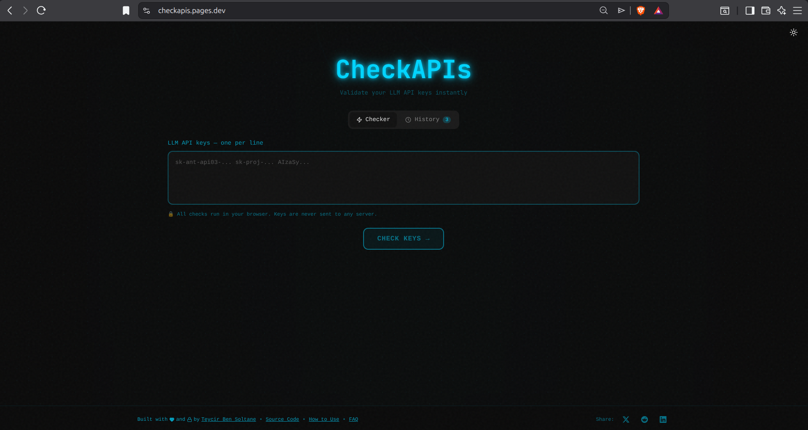
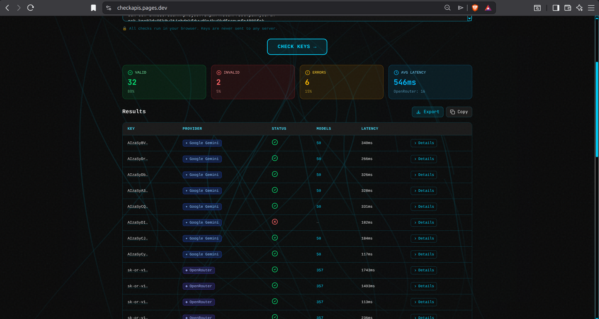
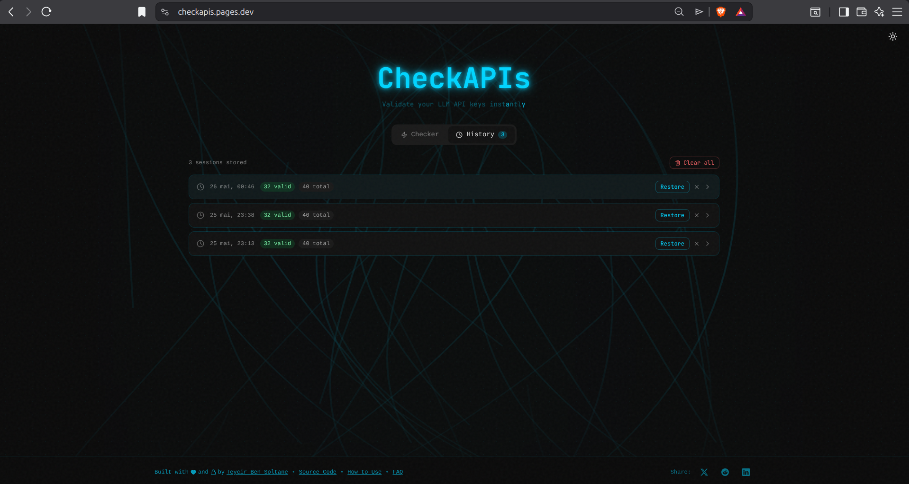

<p align="center">
  
</p>

<p align="center">
  A privacy-first tool to validate LLM API keys instantly — client-side, no server, no logging.
</p>

---

<!-- donation:eth:start -->
<div align="center">

## Support Development

If this project helps your work, support ongoing maintenance and new features.

**ETH Donation Wallet**  
`0x11282eE5726B3370c8B480e321b3B2aA13686582`

<a href="https://etherscan.io/address/0x11282eE5726B3370c8B480e321b3B2aA13686582">
  
</a>

_Scan the QR code or copy the wallet address above._

</div>
<!-- donation:eth:end -->

## Features

- **Zero friction**: Paste keys → click button → get results
- **Multi-vendor support**: OpenAI, Anthropic, Google Gemini, Groq, Perplexity, HuggingFace, Replicate, and more
- **Privacy-first**: All checks run client-side in your browser
- **Detailed results**: View models, latency, rate limits, and error messages
- **Dark mode**: Built-in theme toggle
- **API Access**: Use via curl or any HTTP client
- **CLI Tool**: Command-line interface for automation and scripting

## Screenshots

<div align="center">

### Landing Page


### Validation Results


### History Panel


</div>

## API Usage

CheckAPIs can be used programmatically via HTTP API:

```bash
# Check single key
curl -X POST https://checkapis.pages.dev/api/check \
  -H "Content-Type: application/json" \
  -d '{"keys": ["sk-proj-..."]}'

# Check multiple keys
curl -X POST https://checkapis.pages.dev/api/check \
  -H "Content-Type: application/json" \
  -d '{"keys": ["sk-proj-...", "sk-ant-api03-...", "AIzaSy..."]}'
```

**Response:**
```json
{
  "success": true,
  "count": 1,
  "results": [
    {
      "key": "sk-proj-...",
      "provider": "openai",
      "valid": true,
      "models": ["gpt-4", "gpt-3.5-turbo"],
      "latency": 245,
      "rateLimit": "5000"
    }
  ]
}
```

**Rate Limiting**: 20 requests per minute per IP. See [docs/API.md](./docs/API.md) for full documentation.

## CLI Usage

```bash
# Install and build
npm run build:cli

# Validate keys
node dist/cli/cli/index.js sk-proj-...
node dist/cli/cli/index.js -f keys.txt
cat keys.txt | node dist/cli/cli/index.js --json
```

See [docs/CLI.md](./docs/CLI.md) for full CLI documentation.

## Supported Providers

- OpenAI
- Anthropic (Claude)
- Google Gemini
- Groq
- Perplexity
- HuggingFace
- Replicate
- Together AI
- Cohere
- Mistral
- AWS Bedrock (detection only)
- Azure OpenAI (detection only)

## Development

```bash
npm install
npm run dev
```

Open [http://localhost:3000](http://localhost:3000)

## Build

```bash
npm run build
```

Static files will be generated in the `out` directory.

## Deploy to Cloudflare Pages

### Via Dashboard

1. Build the project: `npm run build`
2. Go to [Cloudflare Pages](https://dash.cloudflare.com/pages)
3. Create a new project
4. Upload the `out` directory

### Via Wrangler CLI

```bash
npm install -g wrangler
wrangler pages deploy out --project-name=checkapi
```

Or use the deployment script:
```bash
./scripts/deploy.sh
```

### Via GitHub Actions

Connect your GitHub repository to Cloudflare Pages. The build settings:

- **Build command**: `npm run build`
- **Build output directory**: `out`
- **Root directory**: `/`

See [docs/DEPLOYMENT.md](./docs/DEPLOYMENT.md) for detailed instructions.

## Privacy & Security

- All API key validation happens in your browser
- Keys are never sent to any proxy server
- Keys are never logged or stored
- Displayed keys are always truncated (first 8 characters only)

## SEO & LLM Visibility

CheckAPI is optimized for both traditional search engines and AI-powered search (ChatGPT, Claude, Perplexity):

- **Structured Data**: JSON-LD schema with FAQPage, WebApplication, and Organization markup
- **LLM Optimization**: llms.txt file for direct AI crawler access
- **AI Crawler Permissions**: Explicit allowances for GPTBot, Claude-Web, PerplexityBot
- **Open Graph**: Dynamic social sharing images
- **Sitemap & Robots**: Optimized for crawl efficiency

See [docs/SEO.md](./docs/SEO.md) for full documentation.

## Tech Stack

- Next.js 16 (App Router)
- TypeScript
- Tailwind CSS
- Lucide React (icons)
- Static export for Cloudflare Pages

## Project Structure

```
├── app/              # Next.js app router pages
├── cli/              # CLI tool
│   ├── index.ts      # CLI entry point
│   └── tsconfig.json # CLI TypeScript config
├── components/       # React components
├── docs/            # Documentation
│   ├── API.md       # API documentation
│   ├── CLI.md       # CLI documentation
│   ├── DEPLOYMENT.md
│   ├── RATE_LIMITING.md
│   └── roadmap.md
├── functions/       # Cloudflare Pages Functions
│   └── api/
│       └── check.js # API endpoint with rate limiting
├── lib/             # Utility functions
│   ├── cli.ts       # Node-compatible exports
│   └── index.ts     # Browser exports
├── public/          # Static assets
├── scripts/         # Deployment and utility scripts
├── tests/           # Test scripts
└── wrangler.toml    # Cloudflare configuration
```

## License

MIT

---

## 🌐 Related Projects

Explore more privacy-first and security tools:

### Privacy & Encryption
- **[Timeseal](https://github.com/Teycir/Timeseal)** - Time-locked encryption vault with Dead Man's Switch. AES-256 split-key crypto, ephemeral seals.
- **[Sanctum](https://github.com/Teycir/Sanctum)** - Zero-trust encrypted vault with cryptographic plausible deniability. XChaCha20-Poly1305, Argon2id.
- **[GhostChat](https://github.com/Teycir/GhostChat)** - True P2P encrypted chat via WebRTC. No servers, no storage, self-destructing messages.
- **[xmrproof](https://github.com/Teycir/xmrproof)** - Monero payment verification, 100% client-side.

### Security Tools
- **[BurpAPISecuritySuite](https://github.com/Teycir/BurpAPISecuritySuite)** - Burp Suite extension for API security testing. 15 attack types, 108+ payloads, BOLA/IDOR detection.
- **[Mcpwn](https://github.com/Teycir/Mcpwn)** - Automated security scanner for Model Context Protocol servers. Detects RCE, path traversal, prompt injection.
- **[SeekYou](https://github.com/Teycir/SeekYou)** - OSINT tool for IP/domain/ASN reconnaissance.
- **[DiffCatcher](https://github.com/Teycir/DiffCatcher)** - Git repo discovery, diff capture, code element extraction.

### MCP Security Servers
- **[burp-mcp-server](https://github.com/Teycir/burp-mcp-server)** - MCP server for Burp Suite Professional. Vulnerability scanning via AI assistants.
- **[nuclei-mcp](https://github.com/Teycir/nuclei-mcp)** - MCP server for Nuclei. Multi-target scanning, severity filtering.
- **[nmap-mcp](https://github.com/Teycir/nmap-mcp)** - MCP server for Nmap. Stealth recon, vuln/NSE scanning.
- **[frida-mcp](https://github.com/Teycir/frida-mcp)** - MCP server for Frida. Dynamic instrumentation, SSL pinning bypass.

---

## 💼 Services Offered

- 🔒 **Privacy-First Development** - P2P applications, encrypted communication, zero-knowledge systems
- 🚀 **Web Application Development** - Full-stack development with Next.js, React, TypeScript
- 🔧 **WebRTC Solutions** - Real-time communication, video/audio streaming, data channels
- 🛡️ **Security Tool Development** - Burp extensions, penetration testing tools, automation frameworks
- 🤖 **AI Integration** - LLM-powered applications, intelligent automation, custom AI solutions

**Get in Touch**: [teycirbensoltane.tn](https://teycirbensoltane.tn) | Available for freelance projects and consulting

---

<div align="center">

**Built with 💚 by [Teycir Ben Soltane](https://teycirbensoltane.tn)**

</div>
